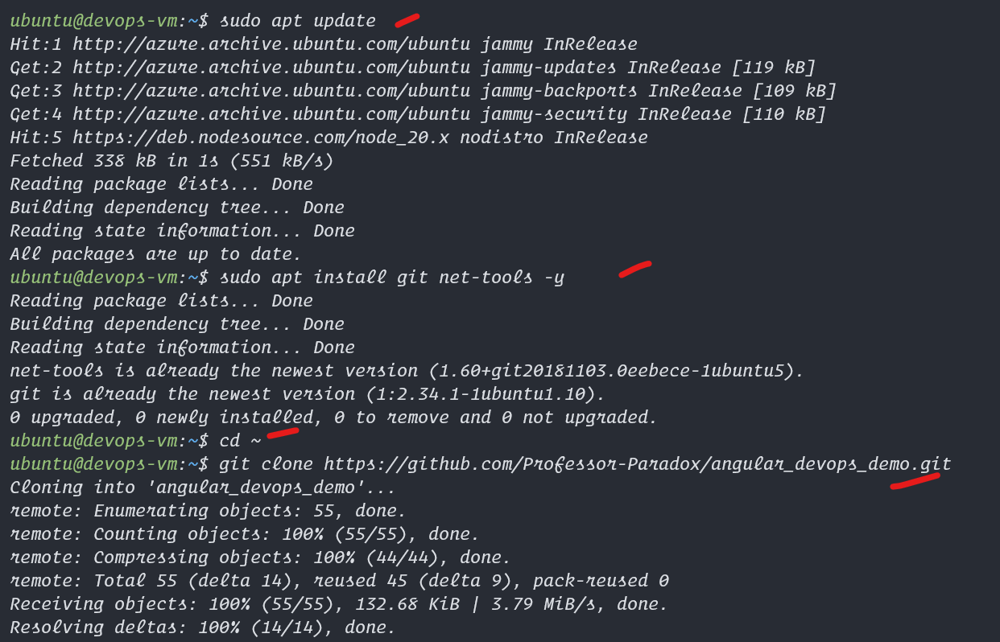
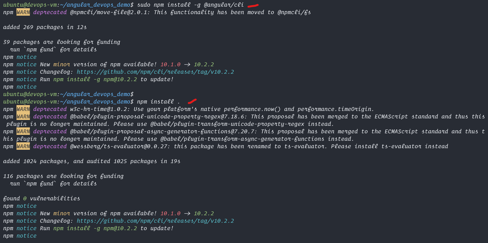

# After Node is installed we can deploy our application 

## Steps to Deploy Angular Application

1. Clone git project `git clone <url>`
2. cd to the directory and `npm install`, which will download the dependencies
3. ng serve to test and click "ctrl+C" to exit serve mode and go to 4th step
4. ng build to get the result files


## Codes to Run in putty
```bash
# step 1
sudo apt update
sudo apt install git net-tools -y
cd ~
git clone https://github.com/Professor-Paradox/angular_devops_demo.git
ls -la
cd angular_devops_demo
ls -la

# step 2
# now in side the angular project directory 
# run this to download dependencies (may take a while)
sudo npm install -g @angular/cli
npm install .

# step 3
# access the <vm-ip> from azure on your web browser in incognito
# <vm-ip>:4200
# Now lets install start angular server 
ng serve --host 0.0.0.0 
# access the vm with <ip>:4200 and check the difference

# exit the ng serve with Ctrl+C combo

# step 4
# build this project for production deployment
ng build --configuration=production

# now we can deploy this built data with a web server
# follow the nginx tutorial for that
```

## Here are the Screenshots


<hr>
  

<hr>
  

<hr>
  

<hr>
  

<hr>
  

<hr>
  

<hr>
  

<hr>
  

<hr>
  