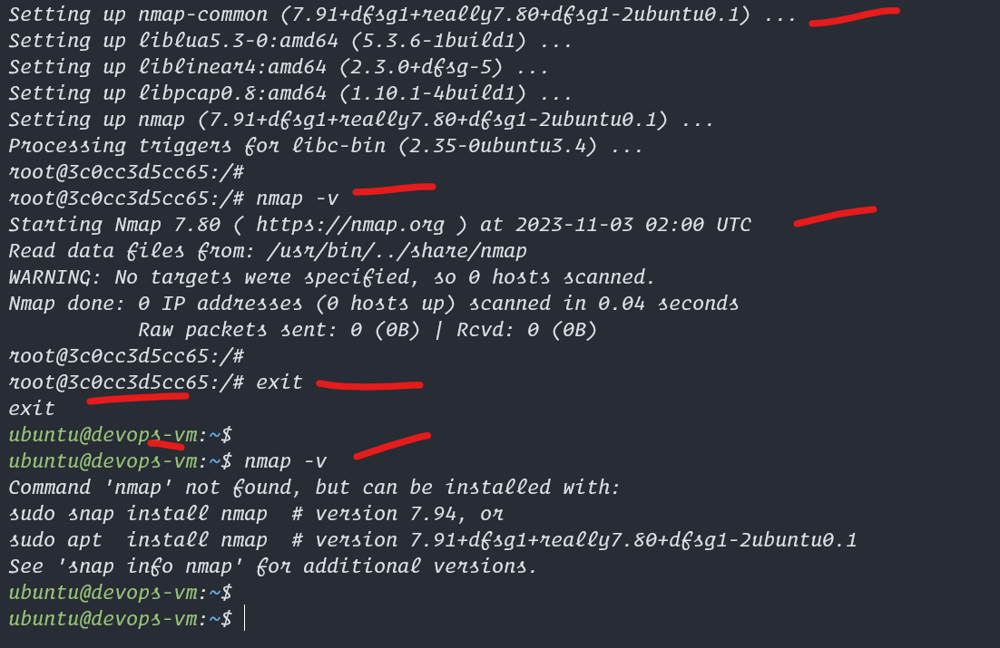

# Install Docker in Ubuntu


1. Run Docker Install Shell Script
2. Access Docker with Sudo access
3. Enable non root user access
4. logout and login or close and open putty session
5. access docker without sudo access


## Commands to Run in putty
```bash
# Install docker latest version on ubuntu
curl -fsSL https://get.docker.com -o ~/get-docker.sh
sudo sh ~/get-docker.sh

# Can accesse docker with 
sudo docker ps

# enable docker for non root user
sudo groupadd docker
sudo usermod -aG docker $USER

# log out from putty or close putty session and open again
docker ps

# before that lets check if nmap is installed in our host vm
nmap -v


# lets test docker by running a ubuntu docker inside our main vm
docker run -it ubuntu bash
# this will open ubuntu inside our docker and lets install some tool like nmap

# now lets go in to the ubuntu docker, make sure the name of the vm chnages
apt update
apt install nmap -y
nmap -v

# now lets exit the docker vm,
exit

# now we are in the main vm, now run nmap -v again there should not be nmap installed
# this is because docker is isolated any thing happens in there is not going to have affect on the host vm.


```

## Here are the Screenshots


<hr>
  

<hr>
  

<hr>
  

<hr>
  

<hr>
  

<hr>
  

<hr>
  

<hr>
  

<hr>
  

<hr>
  
