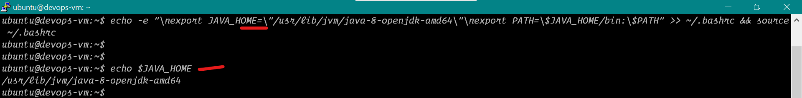

# Install Java on Ubuntu 22


1. Download the openjdk 8 version in ubuntu


## Commands to Run on Putty
```bash
sudo apt update
sudo apt install openjdk-8-jdk -y

java --version

echo -e "\nexport JAVA_HOME=\"/usr/lib/jvm/java-8-openjdk-amd64/\"\nexport PATH=\$JAVA_HOME/bin:\$PATH" >> ~/.bashrc && source ~/.bashrc

echo $JAVA_HOME

```


## Here are the Screenshots


<hr>
  

<hr>
  

<hr>
  

<hr>
  
