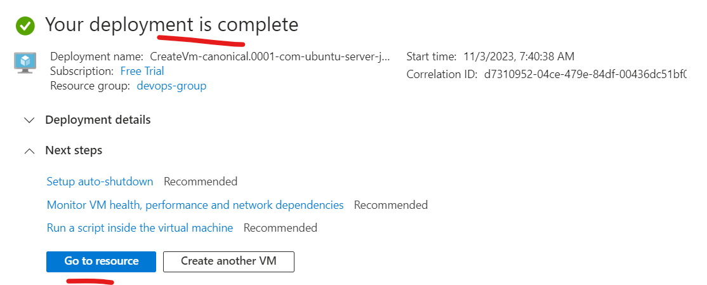
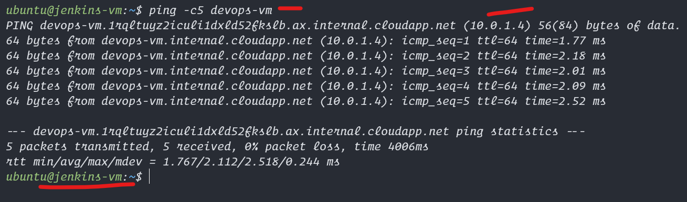
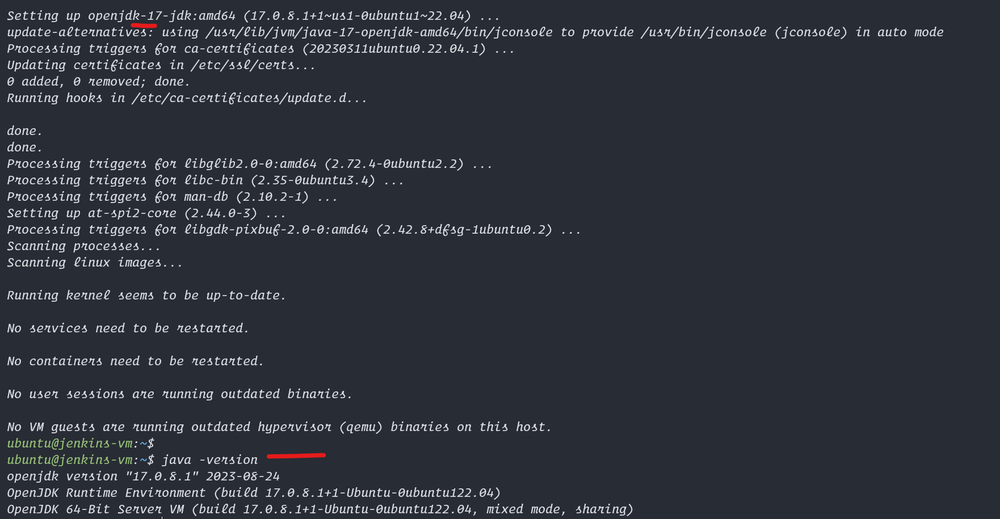

# Jenkins Pipeline Creation

1. Create a new vm in Azure with jenkins-vm as the name and ping both vms
2. ssh some codes on the devops-vm from jenkins-vm
3. install java and jenkins latest version
4. configure jenkins fresh setup
5. create a shell script on "devops-vm" that can be trigger by jenkins-vm
6. create a job in jenkins ui to trigger above script on "devops-vm"

### Explanation of below screenshots after jenkins starts

1. Go to azure and go to your exisitng azure resource group that you created with terraform
2. create a new vm named `jenkins-vm` and provide same settings as below
3. make sure to go back to the network settings and allow all ports in for testing(don't do this in production)


<hr>
  

<hr>
  

<hr>
  

<hr>
  

<hr>
  

<hr>
  

<hr>
  

<hr>
  

<hr>
  

<hr>
  

<hr>
  

<hr>
  

<hr>
  

1. Now create this vm and open in new putty or new ssh session so now you should have two vms and two putty sessions 
Run these commands on each machine with hostname clearly mentioned
```bash
# on both devops-vm and jenkins-vm
# run the commands as needed

# now lets ping each other 

# ping jenkins-vm ip from devops-vm
# this is the same name as the azure vm name you gave
ping -c5 jenkins-vm # ping -c5 10.0.1.5

# lets ping devops-vm from jenkins-vm
ping -c5 devops-vm

# now lets ssh devops-vm(client) from jenkins-vm(controller) so as to automate our work
# for this we need to install jenkins-vm with these commands first

sudo apt update
sudo apt install sshpass -y

# before running any sshpass commands lets first manually ssh to this vm
ssh ubuntu@devops-vm
# this will ask for yes confirm enter yes and then press ctrl+c we need this manual confirmation

# now lets view the ls -la for devops-vm from jenkins-vm this is first step of automation
sshpass -p 'Password@1234' ssh ubuntu@devops-vm 'sudo bash -c ls -la ~'

```


<hr>
  

<hr>
  

<hr>
  

<hr>
  

<hr>
  

<hr>
  

<hr>
  
### run on devops-vm
```bash
# so now we have confirmmation we can control devops-vm from jenkins-vm lets create a script on devops

# on devops-vm run this script to create a file that will build angular project and reload webserver
tee ~/angular_build_jenkins.sh << EOF > /dev/null 
cd ~
git clone https://github.com/Professor-Paradox/angular_devops_demo.git
ls -la
cd angular_devops_demo
ls -la
sudo npm install -g @angular/cli
npm install .
ng build --configuration=production
cd ~; sudo cp -r  ~/angular_devops_demo/dist/angular_devops_demo/* /var/www/html
sudo chmod -R +rx /var/www/html 
sudo systemctl restart nginx
EOF

chmod +x ~/angular_build_jenkins.sh
```


<hr>
  

```bash 
# Now we can trigger the shell script from the jenkins-vm lets try manually with terminal
# after we can do the same with jenkins tool ui
/usr/bin/sshpass -p 'Password@1234' ssh  -o StrictHostKeyChecking=no ubuntu@devops-vm 'sudo bash -c ~/angular_build_jenkins.sh'

```


<hr>
  

<hr>
  

<hr>
  

### Install and Configure Jenkins Tool on Jenkins-vm

```bash
# Install required java and jenkins for this jenkins-vm
sudo apt update
sudo apt install openjdk-17-jdk -y

java -version
# install latest jenkins
sudo wget -O /usr/share/keyrings/jenkins-keyring.asc \
  https://pkg.jenkins.io/debian-stable/jenkins.io-2023.key
echo deb [signed-by=/usr/share/keyrings/jenkins-keyring.asc] \
  https://pkg.jenkins.io/debian-stable binary/ | sudo tee \
  /etc/apt/sources.list.d/jenkins.list > /dev/null
sudo apt update
sudo apt install jenkins -y

# start the jenkins service on port 80 so that azure jenkins-vm port only needs to be opened on this
sudo systemctl enable --now jenkins
sudo systemctl restart jenkins
sudo systemctl status jenkins
```


<hr>
  

<hr>
  

<hr>
  

<hr>
  

<hr>
  

<hr>
  

<hr>
  


#### Configure Jenkins Installed on Ui

1. visit the <jenkins-vm-ip>:8080 on your browser
2. follow the ui steps and get the password from the shown file
   1. `sudo cat /var/lib/jenkins/secrets/initialAdminPassword`
   2. copy the data and paste in the unlock jenkins password field and accept you will go to 
3. Install suggested plugins
4. will take some time and load all extensions if facing error click on retry
5. when done, click on continue,and provide details as you wish
   1. my details are here
   2. username: admin
   3. password: admin
   4. full name: admin
   5. email: admin@gmail.com


<hr>
  

<hr>
  

<hr>
  

<hr>
  

<hr>
  

<hr>
  

<hr>
  

<hr>
  

<hr>
  

<hr>
  

<hr>
  

#### Jenkins Job Creation for Angular building

1. click on the first create job item and then click on freestyle give a name
2. provide the description to this project
3. select the build option as execute shell
4. add the command or script to run for this job
5. save and build the job


<hr>
  

<hr>
  

<hr>
  

<hr>
  

<hr>
  

<hr>
  

<hr>
  

<hr>
  

<hr>
    
