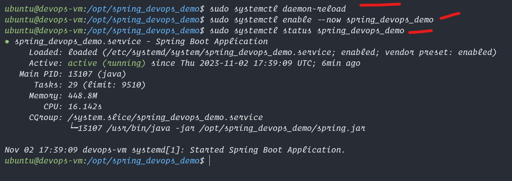
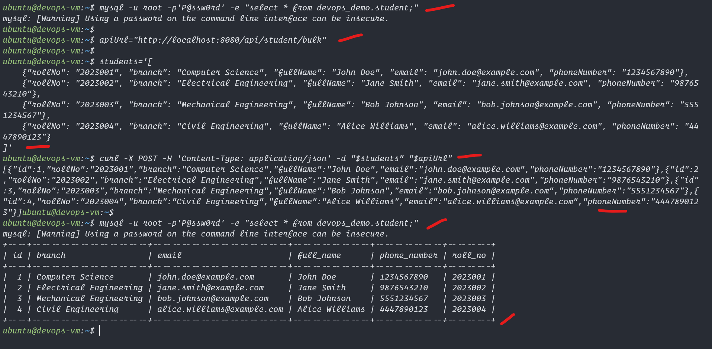

# Build Maven app in Ubuntu 22

1. Install Necessary tools
2. Clone the Git repo
3. build maven app
4. Copy the Jar file
5. Run the Spring App

## Commands to run in Putty
```bash
# Step 1
sudo apt update
sudo apt install git maven net-tools -y

# Step 2
cd ~; git clone https://github.com/Professor-Paradox/spring_devops_demo.git
ls -la 
cd spring_devops_demo
ls -la

# Step 3
chmod +x ./mvnw
./mvnw clean install package -DskipTests

# Step 4 Copy the Jar file
ll ~/spring_devops_demo/target
sudo mkdir -p /opt/spring_devops_demo
sudo cp ~/spring_devops_demo/target/spring_devops_demo-0.0.1-SNAPSHOT.jar /opt/spring_devops_demo/spring.jar

# Step 5:
# Create java properties file, copy entire block of code from tee to EoF and paste in terminal or putty
sudo tee /opt/spring_devops_demo/application.properties << EOF > /dev/null
# DataSource Configuration
spring.datasource.url=jdbc:mysql://localhost:3306/devops_demo
spring.datasource.username=root
spring.datasource.password=P@ssw0rd
spring.datasource.driver-class-name=com.mysql.cj.jdbc.Driver
#server.port=8080

# JPA Configuration
spring.jpa.hibernate.ddl-auto=update
spring.jpa.show-sql=true
spring.jpa.properties.hibernate.format_sql=true
spring.jpa.properties.hibernate.show_sql=true
spring.jpa.properties.hibernate.dialect=org.hibernate.dialect.MySQL8Dialect

# Connection Pooling
spring.datasource.hikari.connection-timeout=20000
spring.datasource.hikari.maximum-pool-size=5
spring.datasource.hikari.minimum-idle=2
spring.datasource.hikari.idle-timeout=30000

# Logging Configuration
logging.level.org.hibernate.SQL=DEBUG
logging.level.org.hibernate.type.descriptor.sql.BasicBinder=TRACE
EOF

sudo chmod -R 755 /opt/spring_devops_demo/

# Run java jar file 
# make sure application.properties and spring.jar file are in the same directory
# Create a systemd service to start this jar file on startup
sudo tee /etc/systemd/system/spring_devops_demo.service << EOF > /dev/null
[Unit]
Description=Spring Boot Application
After=network.target

[Service]
User=ubuntu
ExecStart=/usr/bin/java -jar /opt/spring_devops_demo/spring.jar
SuccessExitStatus=143
StandardOutput=file:/opt/spring_devops_demo/maven.log
StandardError=file:/opt/spring_devops_demo/maven.log

[Install]
WantedBy=multi-user.target
EOF


sudo systemctl daemon-reload
sudo systemctl enable --now spring_devops_demo

# check if the service is running in background
sudo systemctl status spring_devops_demo

# check logs with this
sudo cat /opt/spring_devops_demo/maven.log


# test the api with this code, insert bulk data

# lets test the db now
mysql -u root -p'P@ssw0rd' -e "select * from devops_demo.student;"

apiUrl="http://localhost:8080/api/student/bulk"

students='[
    {"rollNo": "2023005", "branch": "Chemical Engineering", "fullName": "David Miller", "email": "david.miller@example.com", "phoneNumber": "7775551234"},
    {"rollNo": "2023006", "branch": "Biomedical Engineering", "fullName": "Emily Davis", "email": "emily.davis@example.com", "phoneNumber": "1112223344"},
    {"rollNo": "2023007", "branch": "Aerospace Engineering", "fullName": "Michael Wilson", "email": "michael.wilson@example.com", "phoneNumber": "9998887777"},
    {"rollNo": "2023008", "branch": "Information Technology", "fullName": "Olivia Brown", "email": "olivia.brown@example.com", "phoneNumber": "3334445555"},
    {"rollNo": "2023009", "branch": "Electronics and Communication", "fullName": "William Taylor", "email": "william.taylor@example.com", "phoneNumber": "6667778888"},
    {"rollNo": "2023010", "branch": "Environmental Engineering", "fullName": "Sophia Lee", "email": "sophia.lee@example.com", "phoneNumber": "2223334444"},
    {"rollNo": "2023011", "branch": "Industrial Engineering", "fullName": "Ethan Hernandez", "email": "ethan.hernandez@example.com", "phoneNumber": "7776665555"},
    {"rollNo": "2023012", "branch": "Materials Science", "fullName": "Ava Jackson", "email": "ava.jackson@example.com", "phoneNumber": "5554443333"},
    {"rollNo": "2023013", "branch": "Petroleum Engineering", "fullName": "Liam Garcia", "email": "liam.garcia@example.com", "phoneNumber": "8889990000"},
    {"rollNo": "2023014", "branch": "Software Engineering", "fullName": "Mia Martinez", "email": "mia.martinez@example.com", "phoneNumber": "1110009999"},
    {"rollNo": "2023015", "branch": "Biotechnology", "fullName": "Noah Robinson", "email": "noah.robinson@example.com", "phoneNumber": "4445556666"},
    {"rollNo": "2023016", "branch": "Nuclear Engineering", "fullName": "Emma White", "email": "emma.white@example.com", "phoneNumber": "9991112222"},
    {"rollNo": "2023017", "branch": "Computer Engineering", "fullName": "Liam Thomas", "email": "liam.thomas@example.com", "phoneNumber": "6665554444"},
    {"rollNo": "2023018", "branch": "Robotics Engineering", "fullName": "Isabella Turner", "email": "isabella.turner@example.com", "phoneNumber": "2223334444"},
    {"rollNo": "2023019", "branch": "Mathematics", "fullName": "Elijah Adams", "email": "elijah.adams@example.com", "phoneNumber": "7778889999"},
    {"rollNo": "2023020", "branch": "Physics", "fullName": "Grace Hill", "email": "grace.hill@example.com", "phoneNumber": "5556667777"},
    {"rollNo": "2023021", "branch": "Chemistry", "fullName": "Logan Ward", "email": "logan.ward@example.com", "phoneNumber": "9990001111"},
    {"rollNo": "2023022", "branch": "Economics", "fullName": "Abigail Foster", "email": "abigail.foster@example.com", "phoneNumber": "1112223333"},
    {"rollNo": "2023023", "branch": "Political Science", "fullName": "Caleb Perry", "email": "caleb.perry@example.com", "phoneNumber": "4445556666"},
    {"rollNo": "2023024", "branch": "Psychology", "fullName": "Hannah Simmons", "email": "hannah.simmons@example.com", "phoneNumber": "7778889999"}
]'

curl -X POST -H 'Content-Type: application/json' -d "$students" "$apiUrl"

mysql -u root -p'P@ssw0rd' -e "select * from devops_demo.student;"
# we inserted data in to this db with api and test

# get all the same api data to test get method also
curl -X GET "http://localhost:8080/api/student"

# the log files for the folder are located at /opt/spring_devops_demo folder
```
## If getting Data Base issue refer to [Data Base Setup](../../sql/deploy/index.md)

## Here are the Screenshots


<hr>
  

<hr>
  

<hr>
  

<hr>
  

<hr>
  

<hr>
  

<hr>
  

<hr>
  

<hr>
  

<hr>
  

<hr>
  

<hr>
  

<hr>
  

<hr>
  