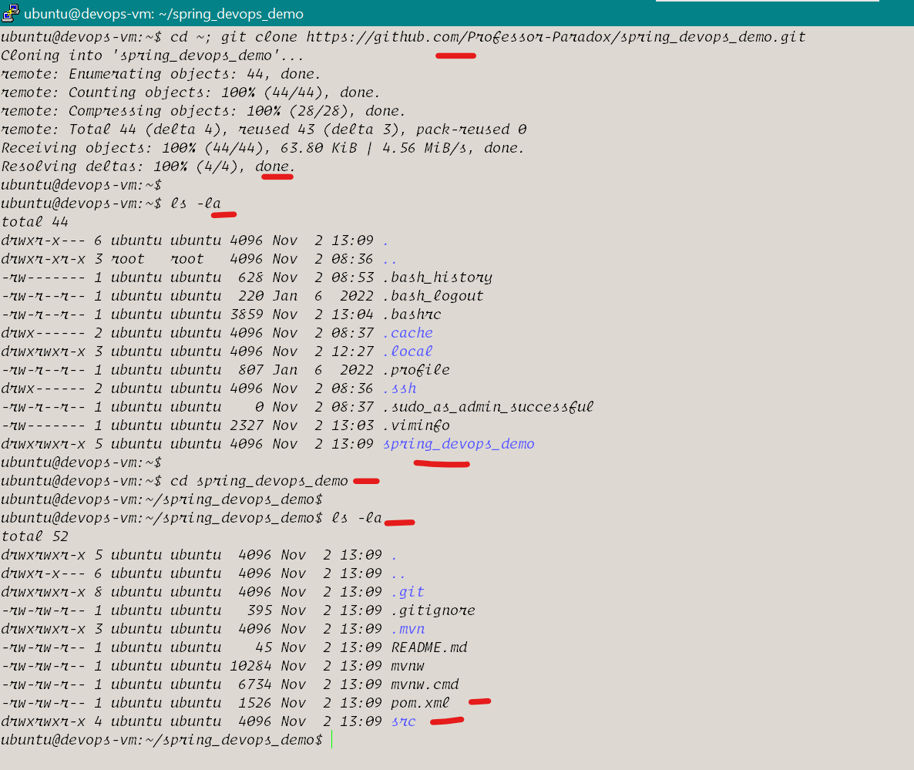
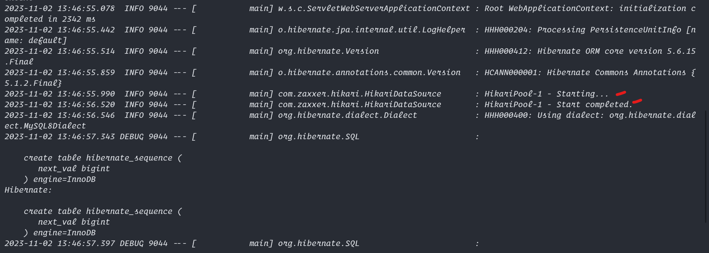

# Build Maven app in Ubuntu 22

1. Install Necessary tools
2. Clone the Git repo
3. build maven app
4. Copy the Jar file
5. Run the Spring App

## Commands to run in Putty
```bash
# Step 1
sudo apt update
sudo apt install git maven net-tools -y

# Step 2
cd ~
git clone https://github.com/Professor-Paradox/spring_devops_demo.git
ls -la 
cd spring_devops_demo
ls -la

# Step 3
chmod +x ./mvnw
./mvnw clean install -DskipTests
./mvnw clean package -DskipTests

# Step 4 Copy the Jar file
ll ~/spring_devops_demo/target
cp ~/spring_devops_demo/target/spring_devops_demo-0.0.1-SNAPSHOT.jar ~/spring.jar
chmod +x ~/spring.jar

# Step 5:
# Create java properties file
tee ~/application.properties << EOF > /dev/null
# DataSource Configuration
spring.datasource.url=jdbc:mysql://localhost:3306/devops_demo
spring.datasource.username=root
spring.datasource.password=P@ssw0rd
spring.datasource.driver-class-name=com.mysql.cj.jdbc.Driver
#server.port=8080

# JPA Configuration
spring.jpa.hibernate.ddl-auto=update
spring.jpa.show-sql=true
spring.jpa.properties.hibernate.format_sql=true
spring.jpa.properties.hibernate.show_sql=true
spring.jpa.properties.hibernate.dialect=org.hibernate.dialect.MySQL8Dialect

# Connection Pooling
spring.datasource.hikari.connection-timeout=20000
spring.datasource.hikari.maximum-pool-size=5
spring.datasource.hikari.minimum-idle=2
spring.datasource.hikari.idle-timeout=30000

# Logging Configuration
logging.level.org.hibernate.SQL=DEBUG
logging.level.org.hibernate.type.descriptor.sql.BasicBinder=TRACE
EOF

sudo chmod 755 ~/application.properties

# Run java jar file 
# make sure application.properties and spring.jar file are in the same directory
java -jar ~/spring.jar > maven.log 2>&1 &


# check if the service is running in background
ps -a


# multiple api code insertion
#!/bin/bash

apiUrl="http://localhost:8080/api/student/bulk"

students='[
    {"rollNo": "2023001", "branch": "Computer Science", "fullName": "John Doe", "email": "john.doe@example.com", "phoneNumber": "1234567890"},
    {"rollNo": "2023002", "branch": "Electrical Engineering", "fullName": "Jane Smith", "email": "jane.smith@example.com", "phoneNumber": "9876543210"},
    {"rollNo": "2023003", "branch": "Mechanical Engineering", "fullName": "Bob Johnson", "email": "bob.johnson@example.com", "phoneNumber": "5551234567"},
    {"rollNo": "2023004", "branch": "Civil Engineering", "fullName": "Alice Williams", "email": "alice.williams@example.com", "phoneNumber": "4447890123"}
]'

curl -X POST -H 'Content-Type: application/json' -d "$students" "$apiUrl"


```
## If getting Data Base issue refer to [Data Base Setup](../../sql/deploy/index.md)

## Here are the Screenshots


<hr>
  

<hr>
  

<hr>
  

<hr>
  

<hr>
  

<hr>
  

<hr>
  

<hr>
  

<hr>
  

<hr>
  

<hr>
  

<hr>
  

<hr>
  

<hr>
  
