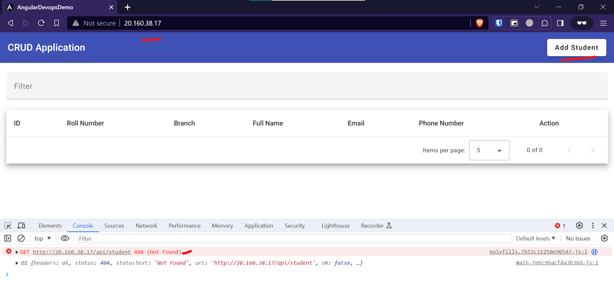

# Install and Setup Nginx Web Server on Ubuntu 22

1. Install nginx Web Server
2. Copy Angular Build Files and modify its permissions
3. Config Modification
4. restart nginx service

## Commands to Run in putty
```bash

# step 1
# Install nginx, access this with <azure-ip:80>
sudo apt install nginx -y

# step 2
# deploy the above build to the nginx server
sudo cp -r  ~/angular_devops_demo/dist/angular_devops_demo/* /var/www/html

# Change File permission
sudo chmod -R +rx /var/www/html

# step 3
sudo tee /etc/nginx/sites-enabled/default << EOF > /dev/null
server {
    listen 80 default_server;
    listen [::]:80 default_server;

    root /var/www/html;

    index index.html index.htm index.nginx-debian.html;

    server_name _;

    location / {
        try_files $uri $uri/ /index.html;
        add_header 'Access-Control-Allow-Origin' '*';
        add_header 'Access-Control-Allow-Methods' 'GET, POST, PUT, DELETE, OPTIONS';
        add_header 'Access-Control-Allow-Headers' 'DNT,User-Agent,X-Requested-With,If-Modified-Since,Cache-Control,Content-Type,Range,Authorization';

        if ($request_method = 'OPTIONS') {
            add_header 'Access-Control-Max-Age' 1728000;
            add_header 'Content-Type' 'text/plain charset=UTF-8';
            add_header 'Content-Length' 0;
            return 204;
        }
    }

    location /api/ {
        proxy_pass http://localhost:8080;
        proxy_http_version 1.1;
        proxy_set_header Upgrade $http_upgrade;
        proxy_set_header Connection 'upgrade';
        proxy_set_header Host $host;
        proxy_cache_bypass $http_upgrade;
    }
}
EOF


# step 4
# restart the service
sudo systemctl restart nginx

# visit the azure vm url and check <azure-ip:80> in incognito
```


## Here are the Screenshots


<hr>
  

<hr>
  

<hr>
  

<hr>
  

<hr>
  

<hr>
  
