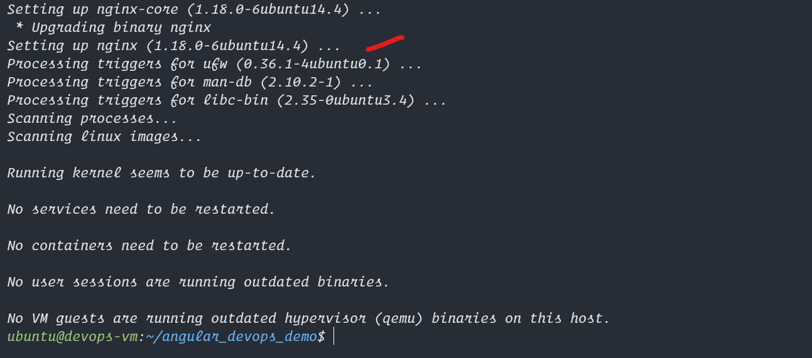
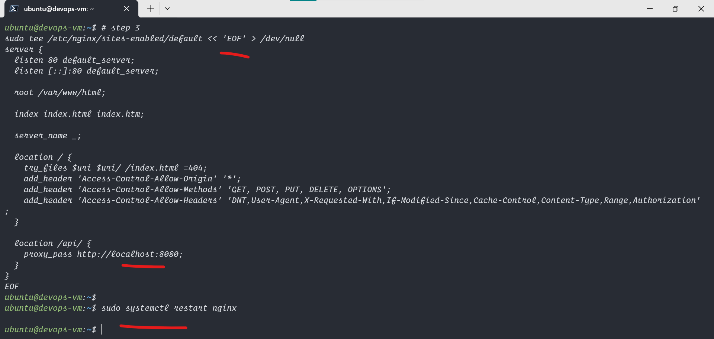
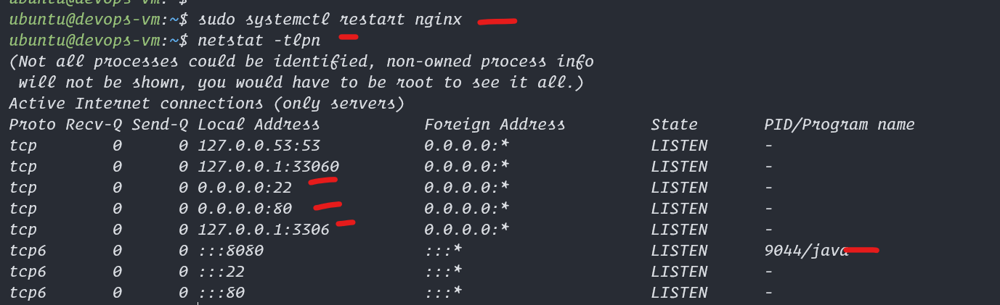

# Install and Setup Nginx Web Server on Ubuntu 22

1. Install nginx Web Server
2. Copy Angular Build Files and modify its permissions
3. restart nginx service

## Commands to Run in putty
```bash

# step 1
# Install nginx, access this with <azure-ip:80>
sudo apt install nginx -y

# step 2
# deploy the above build to the nginx server
sudo cp -r  ~/angular_devops_demo/dist/angular_devops_demo/* /var/www/html

# Change File permission
sudo chmod -R +rx /var/www/html

# step 3
# restart the service
sudo systemctl restart nginx

# visit the azure vm url and check <azure-ip:80> in incognito
```


## Here are the Screenshots


<hr>
  

<hr>
  

<hr>
  

<hr>
  

<hr>
  

<hr>
  
