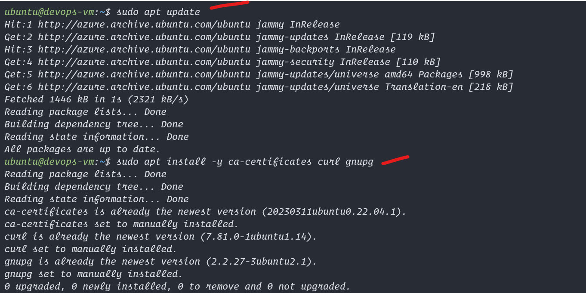
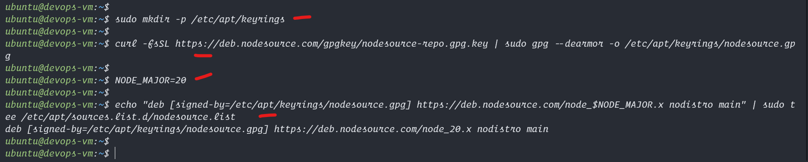
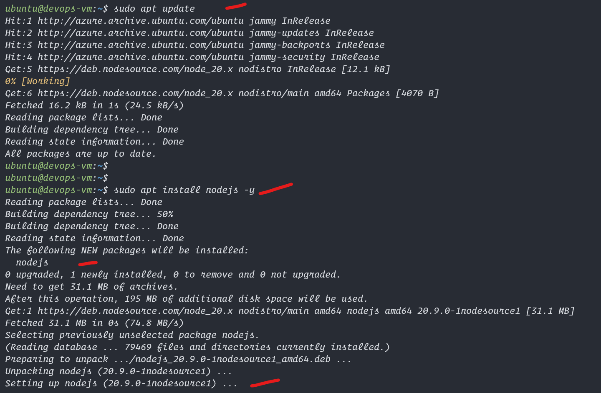

# Lets Install Node in our Ubuntu vm

## Commands to install Node in Ubuntu 22
```bash
sudo apt update
sudo apt install -y ca-certificates curl gnupg
sudo mkdir -p /etc/apt/keyrings
curl -fsSL https://deb.nodesource.com/gpgkey/nodesource-repo.gpg.key | sudo gpg --dearmor -o /etc/apt/keyrings/nodesource.gpg

NODE_MAJOR=20
echo "deb [signed-by=/etc/apt/keyrings/nodesource.gpg] https://deb.nodesource.com/node_$NODE_MAJOR.x nodistro main" | sudo tee /etc/apt/sources.list.d/nodesource.list

sudo apt update

# run this individually
sudo apt install nodejs -y


# npm and node check
npm -v
node -v

```

## Screenshots


<hr>
  

<hr>
  

<hr>
  

<hr>
  
## Commands to uninstall node in Ubuntu 22(WARNING CAUTION)

```bash
sudo apt purge nodejs -y
sudo rm -r /etc/apt/sources.list.d/nodesource.list
sudo rm -r /etc/apt/keyrings/nodesource.gpg
```
