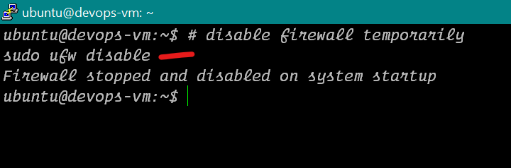
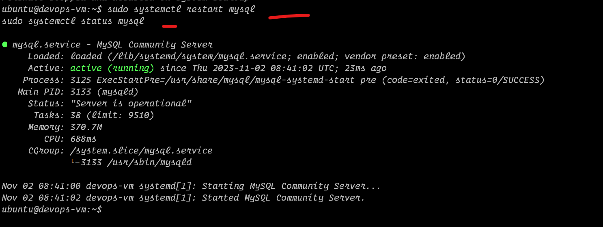
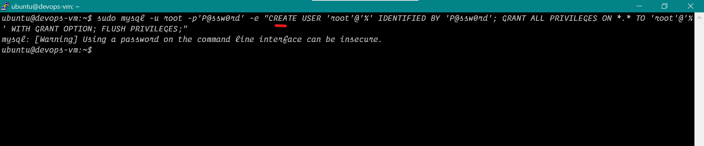
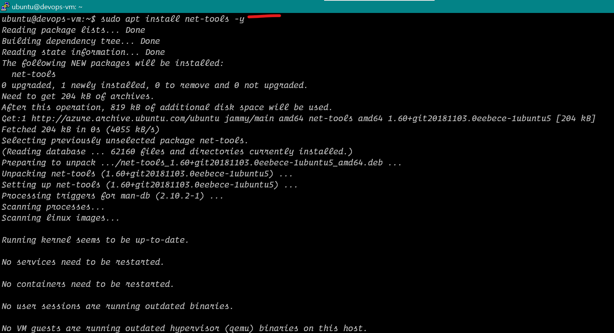

# Install and Deploy Mysql Server on Ubuntu

1. Install Mysql
2. Start the Database
3. Configure Mysql 
4. Create database with mysql
5. Verify Database


## Run these commands on putty
```bash
# Step 1
sudo apt update
sudo apt install mysql-server -y
mysql --version

# Step 2
sudo systemctl restart mysql
sudo systemctl status mysql

# Step 3 (Only run this once to create a password for root account)
sudo mysql -u root -p

# modifying mysql behavior
# run inside the mysql> cli
# create root user password
ALTER USER 'root'@'localhost' IDENTIFIED WITH mysql_native_password BY 'P@ssw0rd';

# exit mysql after providing password
exit

# now we can use bash script to run the sql commands with root user and password we created 
# disable firewall temporarily
sudo ufw disable

# restart service to apply
sudo systemctl restart mysql
sudo systemctl status mysql

# Run the below command In normal putty, Not in mysql
sudo mysql -u root -p'P@ssw0rd' -e "CREATE USER 'root'@'%' IDENTIFIED BY 'P@ssw0rd'; GRANT ALL PRIVILEGES ON *.* TO 'root'@'%' WITH GRANT OPTION; FLUSH PRIVILEGES;"

# Step 4
mysql -u root -p'P@ssw0rd' -e "create database devops_demo; use devops_demo;"

# Step 6
# verify database and tables are created
mysql -u root -p'P@ssw0rd' -e "select * from devops_demo.student;"

# check the ports opened
sudo apt install net-tools -y
netstat -tulpn

# Start up the Java API to test
```


## Here are the Screenshots


<hr>
  

<hr>
  

<hr>
  

<hr>
  

<hr>
  

<hr>
  

<hr>
  

<hr>
  

<hr>
  

<hr>
  

<hr>
  

<hr>
  

<hr>
  