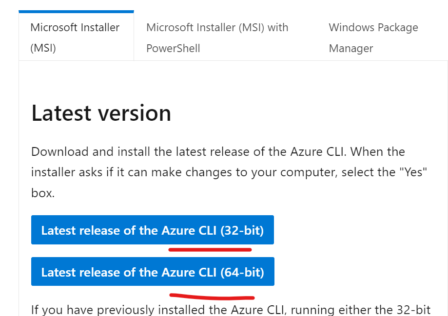
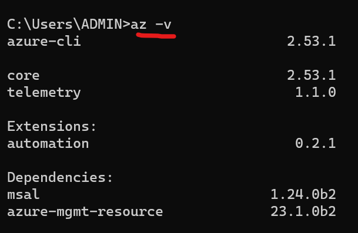

# Install Azure CLI on Windows Machine

1. Visit this Link to Download [Azure CLI](https://learn.microsoft.com/en-us/cli/azure/install-azure-cli-windows?tabs=azure-cli)

  
  

2. Now Double Click the Application and Install it with default setup
 
  
  

3. After Azure Cli is installed lets test the version, open cmd and run `az -v`
 
  
