# Install Git on Windows

1. Download git from [Git Official Website](https://git-scm.com/downloads)

  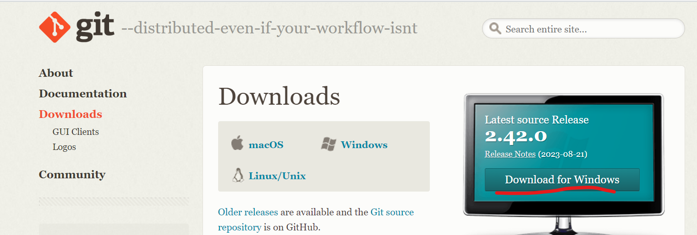

2. Click on the 32 bit or 64 bit as needed

  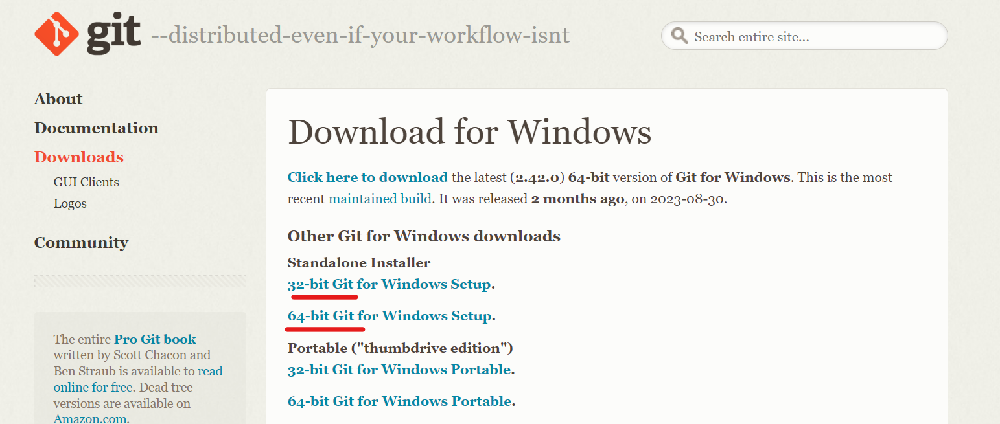

3. Click on the Downloaded git exe file and then give permissions

   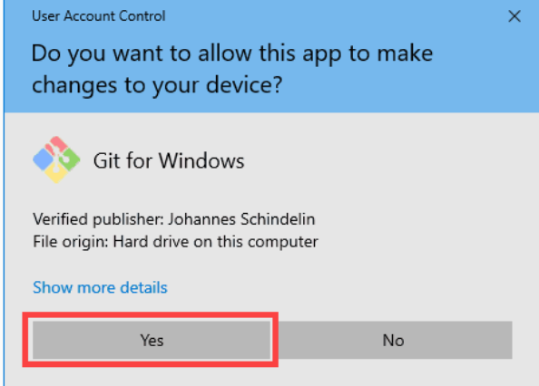
   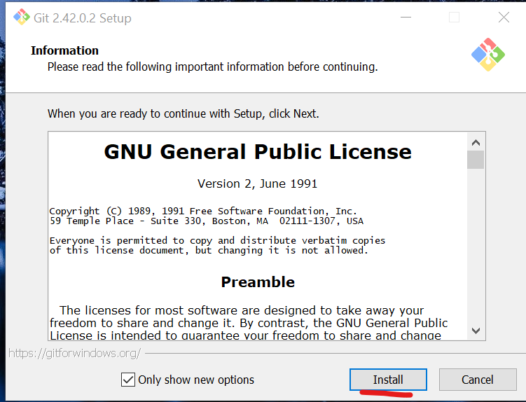

4. Click next and agree to permissions and click next

   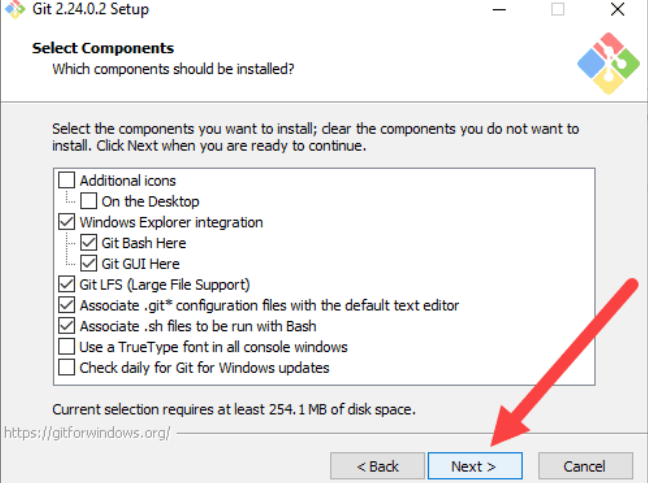
   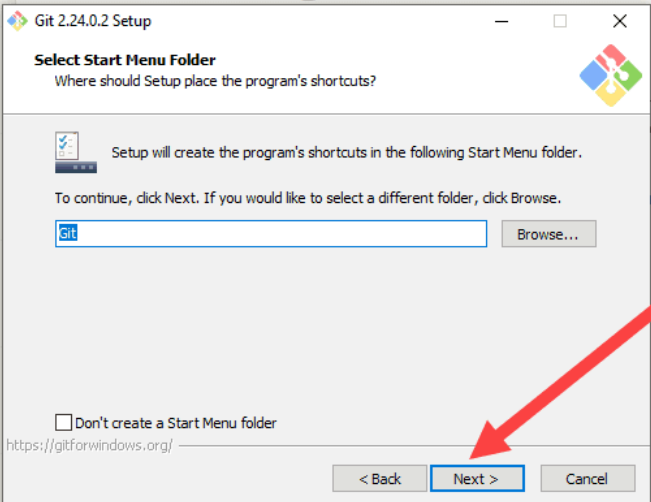

5. when you reach this option change the value to visual studio code as the text editor for git

   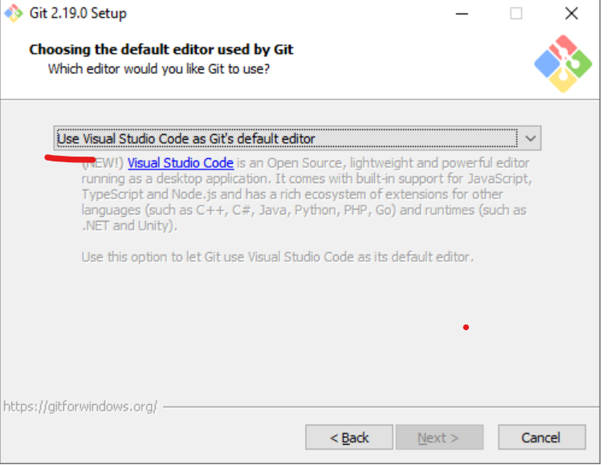

6. from now on just select all the options as default and click on next till you reach this point.

   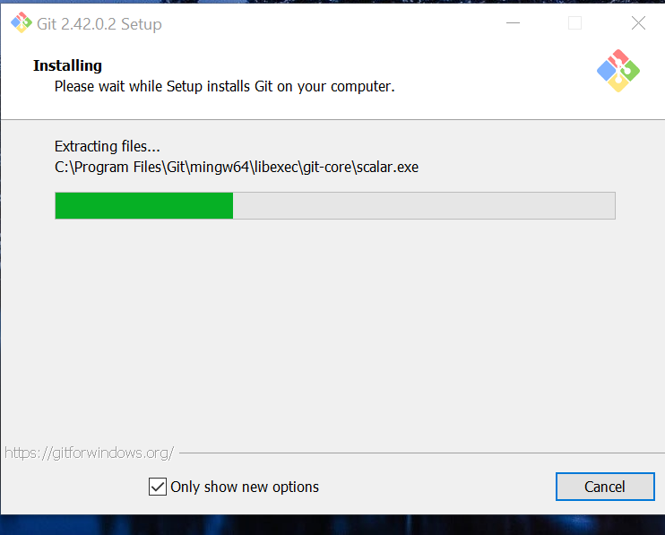

7. now close the installer and open cmd and verify if git is working

   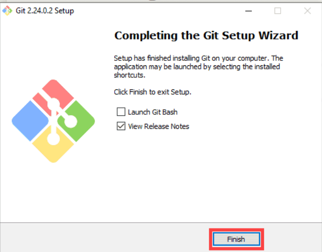
   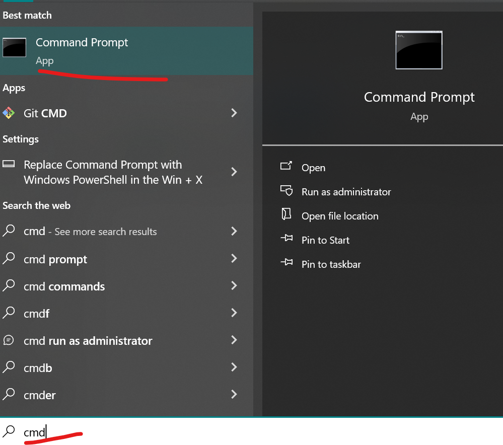

8. run this command and check the version of installed git `git -v`

   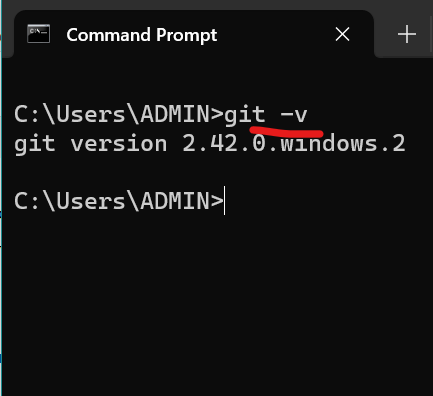
