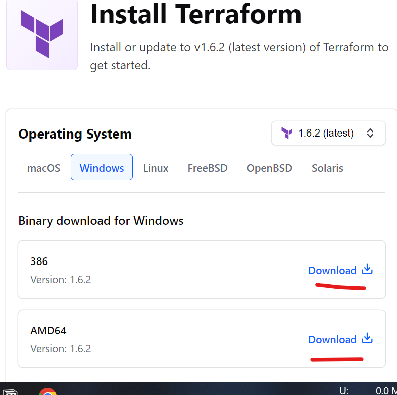
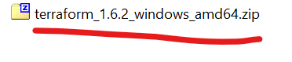
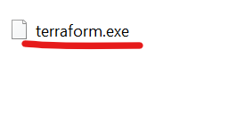
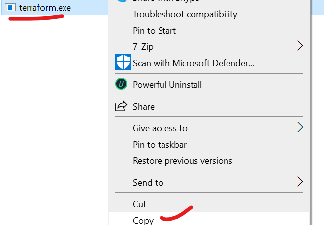
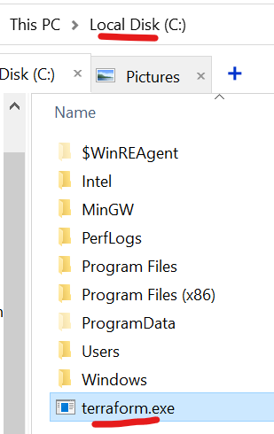
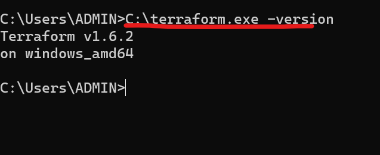

# Installing Terraform on Windows

1. Visit [Terraform Download](https://developer.hashicorp.com/terraform/downloads) Page and Download the Required package for windows

  
  
2. Extract the Zip folder and select the terraform.exe

  
  

3. In the Windows C: folder copy this and paste the file. If a **continue** option is displayed click yes the result should look like this.

  
  

4. Now When ever need to use terraform we need to `C:\terraform.exe` command to use that, lets open cmd and try `C:\terraform.exe -version`

  
