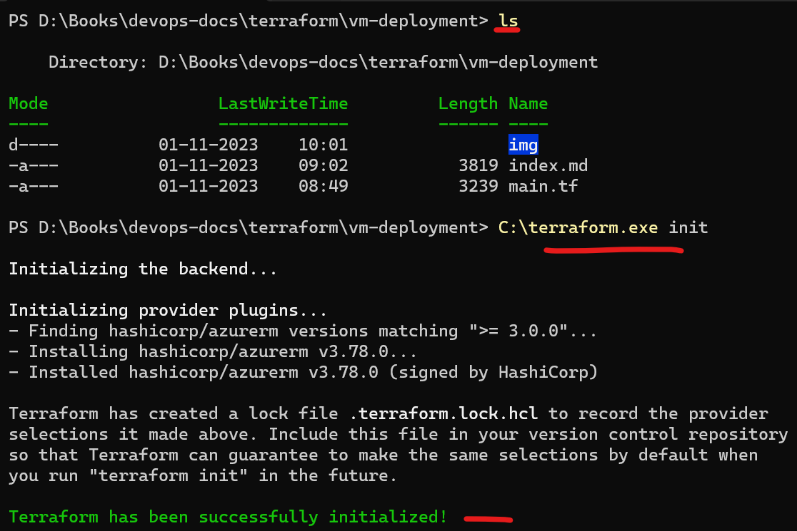
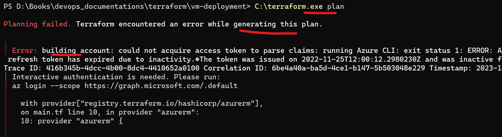
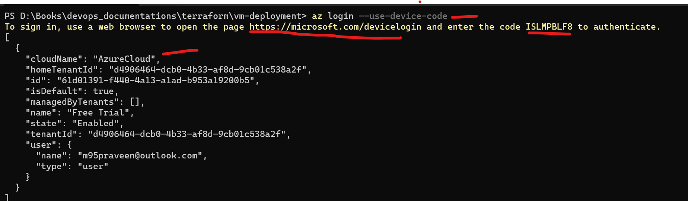
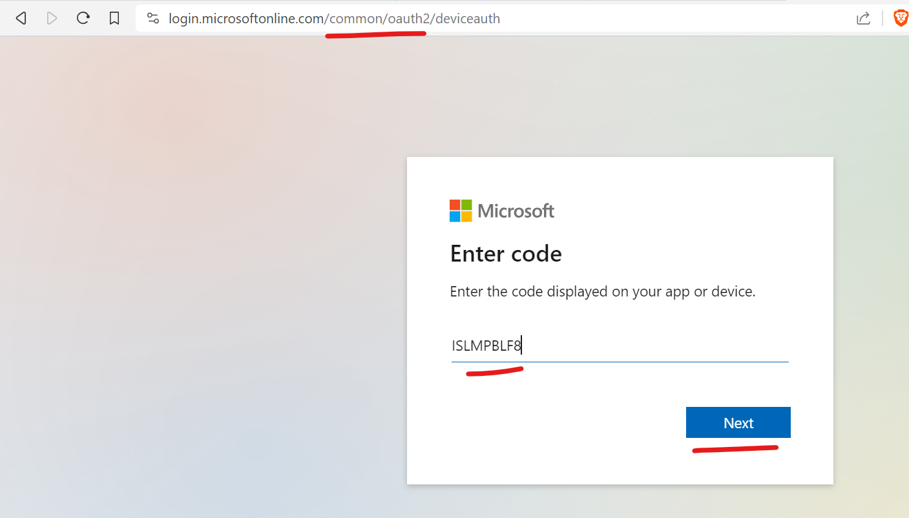
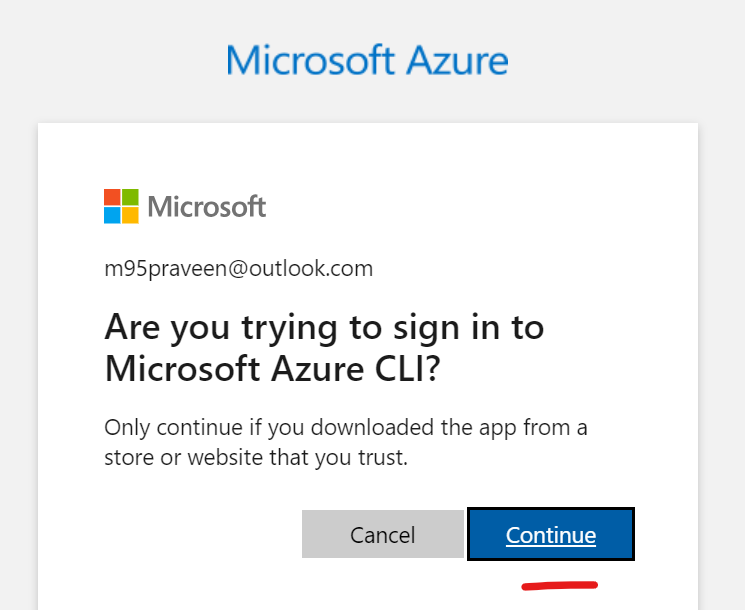
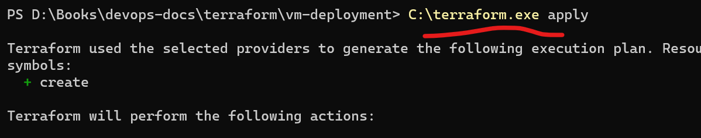
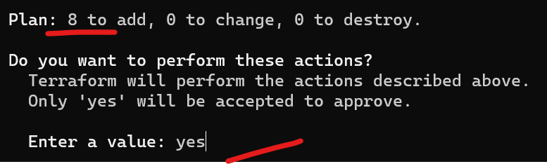
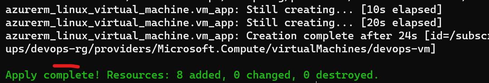
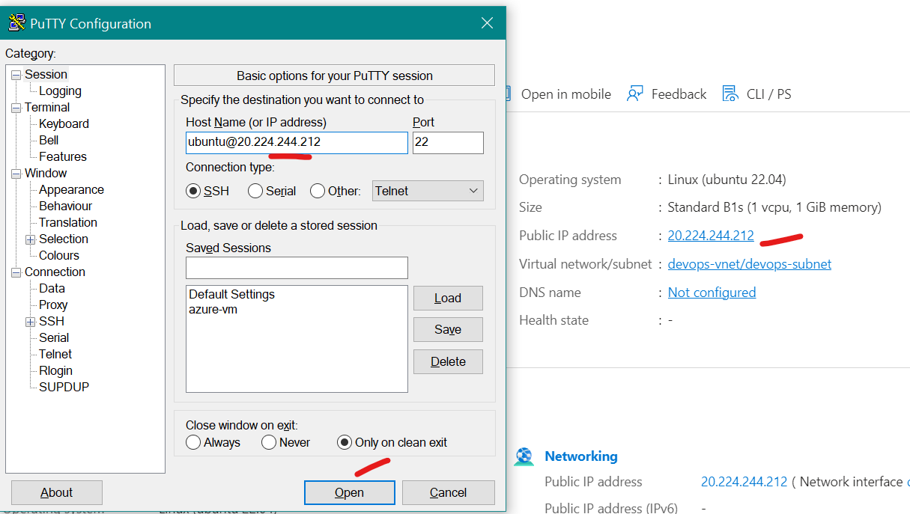
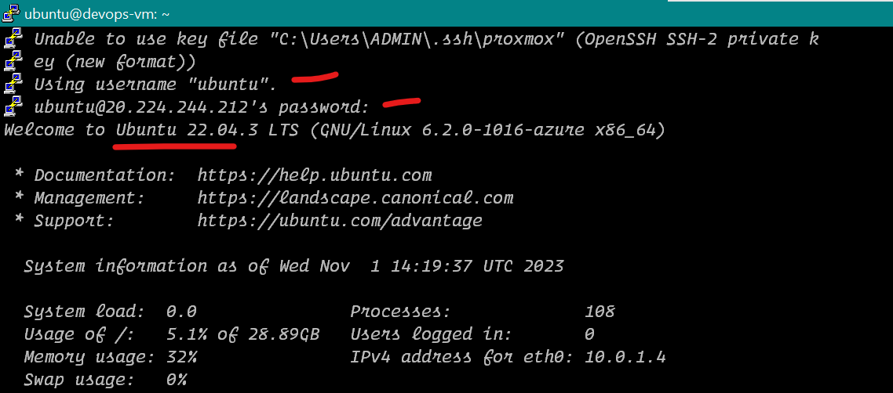

# Terraform

Advantages

1. Reusable
2. predictable
3. Easy Debug
4. Scalable
5. Fast

## Steps to Create Ubuntu VM

1. After Downloading the Terraform 64 bit and extract to C:\
2. create a new folder in your pc and cd to the folder, create a new 'main.tf' file with vscode and paste the below code 
3. run the code with 'C:\terraform.exe <command>' 
4. if issue arises login to azure with 'az login'
5. Once vm Creation is done use putty to connect with ip and username, password

To use Terraform copy and paste the below code to your file

```hcl
terraform {
  required_providers {
    azurerm = {
      source  = "hashicorp/azurerm"
      version = ">=3.0.0"
    }
  }
}

provider "azurerm" {
  features {}
}

resource "azurerm_resource_group" "resource_group" {
  name     = "devops-rg"
  location = "West Europe"
}

resource "azurerm_virtual_network" "virtual_network" {
  name                = "devops-vnet"
  resource_group_name = azurerm_resource_group.resource_group.name
  location            = azurerm_resource_group.resource_group.location
  address_space       = ["10.0.0.0/16"]
}

resource "azurerm_subnet" "public_subnet" {
  name                 = "devops-subnet"
  resource_group_name  = azurerm_resource_group.resource_group.name
  virtual_network_name = azurerm_virtual_network.virtual_network.name
  address_prefixes     = ["10.0.1.0/24"]
}

resource "azurerm_network_security_group" "nsg_app" {
  name                = "devops-vm-nsg"
  resource_group_name = azurerm_resource_group.resource_group.name
  location            = azurerm_resource_group.resource_group.location

  security_rule {
    name                       = "AllowAllInbound"
    priority                   = 100
    direction                  = "Inbound"
    access                     = "Allow"
    protocol                   = "*"
    source_port_range          = "*"
    destination_port_range     = "*"
    source_address_prefix      = "*"
    destination_address_prefix = "*"
  }
}
resource "azurerm_public_ip" "public_ip_app" {
  name                = "devops-vm-public-ip"
  resource_group_name = azurerm_resource_group.resource_group.name
  location            = azurerm_resource_group.resource_group.location
  allocation_method   = "Static"
}

resource "azurerm_network_interface" "nic_app" {
  name                = "devops-vm-nic"
  resource_group_name = azurerm_resource_group.resource_group.name
  location            = azurerm_resource_group.resource_group.location

  ip_configuration {
    name                          = "internal"
    private_ip_address_allocation = "Dynamic"
    subnet_id                     = azurerm_subnet.public_subnet.id
    public_ip_address_id          = azurerm_public_ip.public_ip_app.id
  }
}

resource "azurerm_network_interface_security_group_association" "nsg_nic_app" {
  network_interface_id      = azurerm_network_interface.nic_app.id
  network_security_group_id = azurerm_network_security_group.nsg_app.id
}


resource "azurerm_linux_virtual_machine" "vm_app" {
  resource_group_name   = azurerm_resource_group.resource_group.name
  location              = azurerm_resource_group.resource_group.location
  network_interface_ids = [azurerm_network_interface.nic_app.id]

  name = "devops-vm"

  admin_username                  = "ubuntu"
  admin_password                  = "Password@1234"
  disable_password_authentication = false
  size                            = "Standard_B1s"

  os_disk {
    caching              = "ReadWrite"
    storage_account_type = "Premium_LRS"

  }

  source_image_reference {
    publisher = "Canonical"
    offer     = "0001-com-ubuntu-server-jammy"
    sku       = "22_04-lts"
    version   = "latest"

  }
}
```


# here are the screenshots


<hr>
  

<hr>
  

<hr>
  

<hr>
  

<hr>
  

<hr>
  

<hr>
  

<hr>
  

<hr>
  

<hr>
  